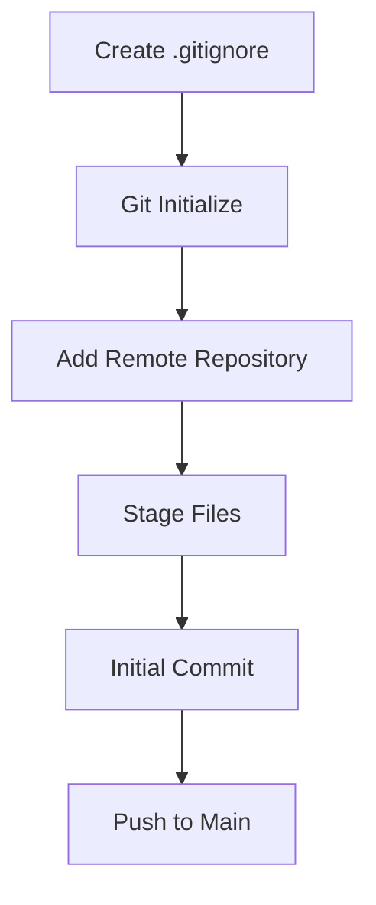
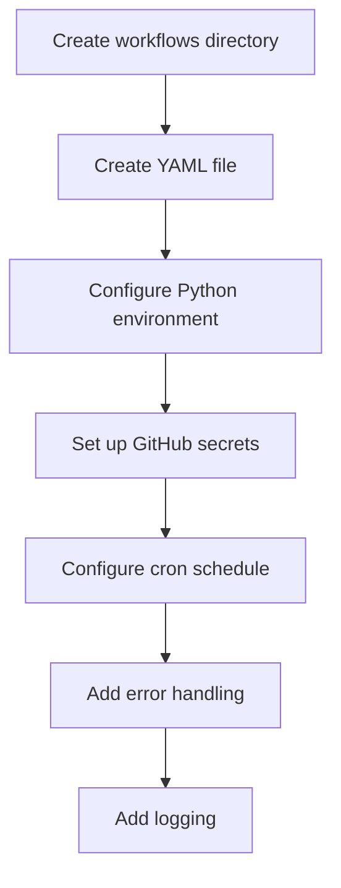
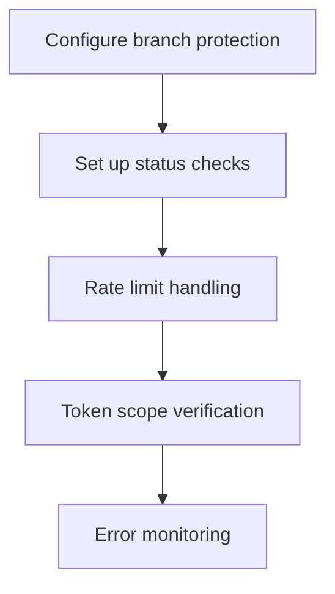

# GitHub Integration Plan

## 1. Repository Setup
- Create .gitignore to exclude:
  - .env file (contains sensitive data)
  - venv/ directory (virtual environment)
  - *.pyc files and __pycache__
  - any IDE-specific files

## 2. Initial Code Push

## 3. GitHub Actions Workflow Setup

### Workflow Details:
1. Create `.github/workflows/follow_sync.yml`
2. Configure workflow to run every minute using cron: `* * * * *`
3. Workflow steps:
   - Set up Python 3.x
   - Install dependencies from requirements.txt
   - Run the script with environment variables from secrets
4. Add error handling and logging
5. Configure GitHub Secrets:
   - `GH_USERNAME`: GitHub username
   - `GH_TOKEN`: GitHub personal access token with `user:follow` scope

## 4. Security Considerations

- Add rate limit handling in the script
- Ensure token has minimal required permissions
- Set up error notifications
- Add logging for monitoring

## 5. Documentation
- Create README.md with:
  - Project description
  - Setup instructions
  - Configuration guide
  - GitHub Actions workflow explanation
  - Security considerations

## Implementation Steps

1. First Phase - Local Setup:
   - Create .gitignore
   - Initialize git repository
   - Create initial README.md
   - Stage and commit files

2. Second Phase - GitHub Integration:
   - Add remote repository
   - Push code to GitHub
   - Configure branch protection (optional)

3. Third Phase - GitHub Actions:
   - Create workflows directory and YAML file
   - Set up GitHub Secrets
   - Test workflow
   - Monitor first runs

4. Fourth Phase - Monitoring:
   - Set up notifications for failures
   - Monitor rate limits
   - Review logs