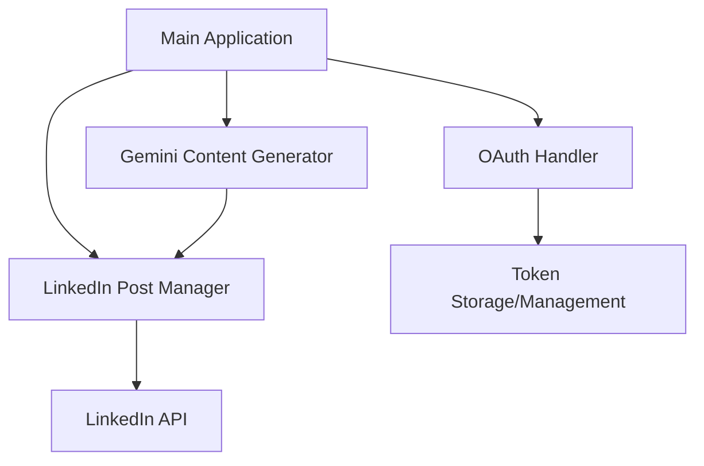
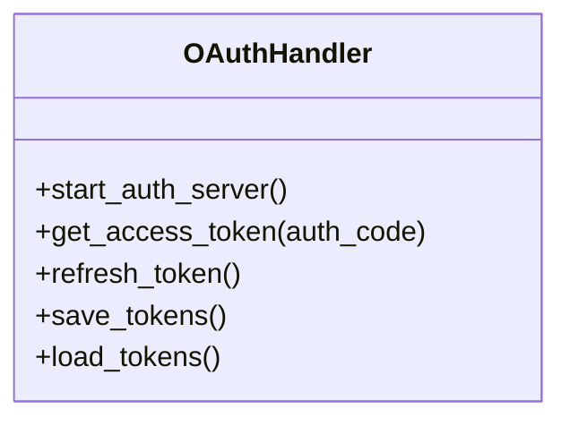
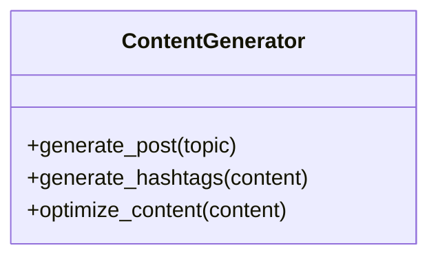
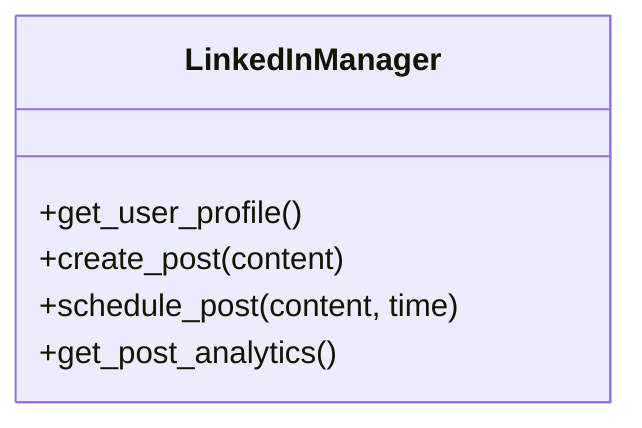
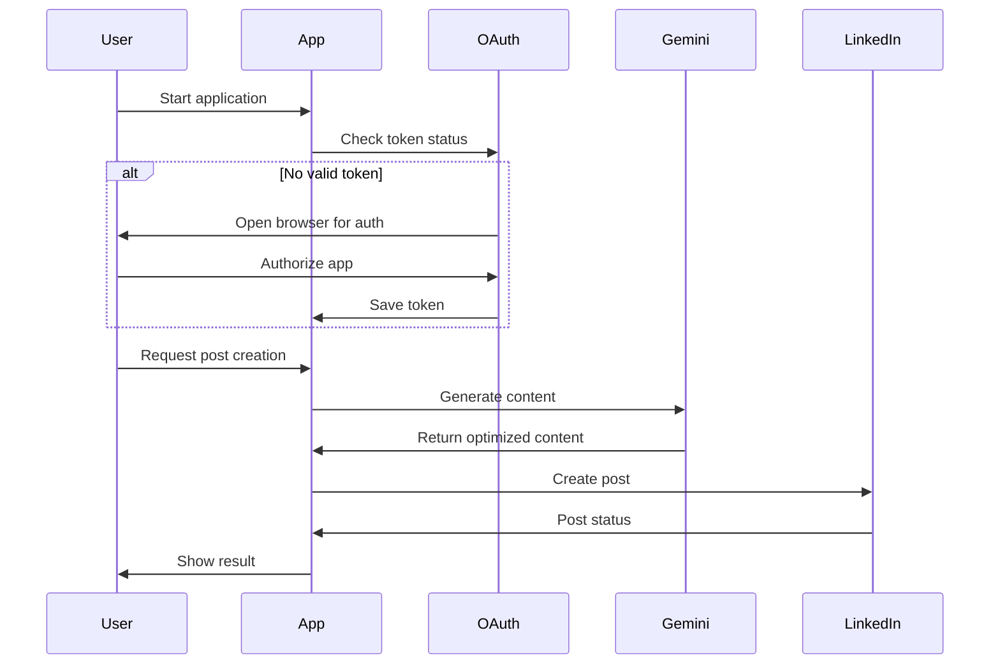

# LinkedIn Post Automation with Gemini Integration

## Current Issues
1. Separate files for OAuth flow (server.py and get_access_token.py)
2. Hard-coded access token and user ID in linkedIn.py
3. Not using Gemini for content generation
4. Manual process for getting access tokens
5. Sensitive credentials in code (should be in .env)

## Architecture Overview



## Component Design

### 1. OAuth Handler Class

- Implements complete OAuth flow
- Handles token storage and refresh
- Uses async server for callback handling

### 2. Gemini Integration

- Implement proper Gemini API integration
- Add content optimization
- Generate relevant hashtags
- Handle rate limiting and errors

### 3. LinkedIn Post Manager

- Handle all LinkedIn API interactions
- Implement post scheduling
- Add error handling and retries
- Track post performance

## Application Flow



## Technical Specifications

### File Structure
```
linkedin_poster/
├── .env
├── src/
│   ├── __init__.py
│   ├── main.py
│   ├── oauth_handler.py
│   ├── content_generator.py
│   ├── linkedin_manager.py
│   └── utils.py
├── tests/
├── requirements.txt
└── README.md
```

### Dependencies
Current:
- requests
- python-dotenv
- urllib3>=2.0.0

To Add:
- google-generativeai
- fastapi
- uvicorn
- python-jose
- aiohttp

### Security Measures
1. Token encryption at rest
2. Rate limiting implementation
3. Proper error handling
4. Logging for debugging
5. API quota management

### Environment Variables
Required variables in .env:
```
LINKEDIN_CLIENT_ID=your_client_id
LINKEDIN_CLIENT_SECRET=your_client_secret
GEMINI_API_KEY=your_gemini_key
REDIRECT_URI=http://localhost:8000/callback
```

## Implementation Steps

1. **Setup Project Structure**
   - Create new directory structure
   - Initialize virtual environment
   - Install required dependencies
   - Setup environment configuration

2. **OAuth Implementation**
   - Create OAuth handler class
   - Implement token management
   - Setup callback server
   - Add token refresh mechanism

3. **Gemini Integration**
   - Setup Gemini client
   - Implement content generation
   - Add content optimization
   - Create hashtag generation

4. **LinkedIn Manager**
   - Create LinkedIn API wrapper
   - Implement post creation
   - Add scheduling capability
   - Setup analytics tracking

5. **Main Application**
   - Implement main application logic
   - Add CLI interface
   - Setup logging
   - Add error handling

6. **Testing**
   - Unit tests for each component
   - Integration tests
   - End-to-end testing